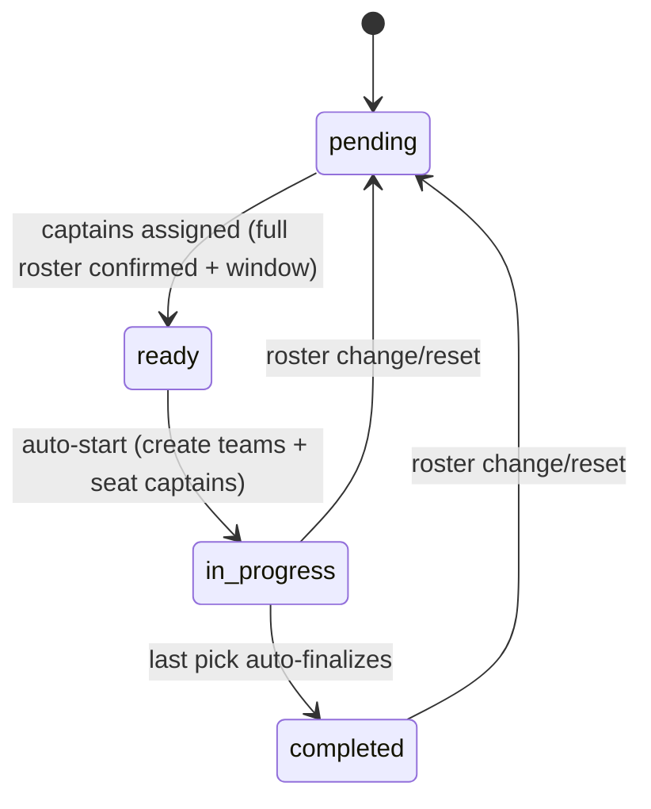

# Draft System Analysis (Current + Target)

This captures the current implementation plus the updated direction we agreed on.
Order follows app entry points -> state/view model -> backend APIs.

## Entry Points (Screens)
- Home: `apps/expo/app/(drawer)/(tabs)/index.tsx` -> `HomeScreen` -> `QuickJoinCard`.
- Game detail: `apps/expo/app/games/[id].tsx` -> `GameDetailScreen`.
- Draft room: `apps/expo/app/games/[id]/draft.tsx` -> `GameDraftScreen`.
- Web mirrors: `apps/next/pages/games/[id].tsx`, `apps/next/pages/games/[id]/draft.tsx`.

## Draft Components & Hooks
- Home draft card: `packages/app/features/home/components/QuickJoinCard.tsx`,
  `packages/app/features/home/components/ScheduleTeaserCard.tsx`.
- Detail draft card: `packages/app/features/games/detail-screen.tsx` (DraftStatusCard).
- Draft room UI: `packages/app/features/games/draft-screen.tsx`.
- Captain selection: `packages/app/features/games/components/CaptainSelector.tsx`.
- Draft state: `packages/app/features/games/state/deriveDraftViewModel.ts`.
- Detail state: `packages/app/features/games/useGameDetailState.ts`.
- Draft realtime: `packages/app/utils/useTeamsState.ts`.
- Games realtime: `packages/app/utils/useRealtimeSync.ts`.

## Draft UI Visibility (Current)
- Home draft card shows when `draftStatus` is `ready` or `in_progress`.
- Detail draft card shows when `draftStatus !== 'completed'` and either the roster is full or draft is already started.
- Draft room always renders; copy varies for `pending`, `ready`, `in_progress`, `completed`.

## Draft Copy Summary (Current)
- Home: "Draft is happening now" (live), "Draft starting now" (ready) in `QuickJoinCard`.
- Detail card:
  - pending: "Pick captains to unlock drafting" / "Captains coming soon"
  - ready: "Captains set" / "Draft starting now"
  - in_progress: "Draft is live" / "Draft happening now"
  - completed: "Teams locked in"
- Draft room:
  - "Assign captains..." (admin), "Captains need to be assigned..." (pending)
  - "Draft starting now..." (ready), "Draft is live..." (in_progress), "Draft complete..." (completed)
  - "You're on the clock..." / "You're up next..." (captain prompts)
- Result gating: "Draft not finalized" / "Teams not ready yet..."
- Push notifications: draft ready, start, pick, complete, reset in `packages/api/src/services/notifications.ts`.

## State / View Model (Current)
- `deriveDraftViewModel` combines game detail + realtime draft meta.
- Captains are excluded from the available pick list and pre-seated into teams.
- `canPick` is admin or captain-on-turn only.
- `nextSnakeTurn` supports N teams already (`packages/api/src/domain/draft.ts`).

## Backend APIs (Current)
- `games.assignCaptains` assigns N captains, validates full confirmed roster + confirmation window, sets `draft_status = ready`, then auto-starts.
- `startDraftForGame` randomizes team order, creates teams, seats captains, sets `draft_status = in_progress`.
- `teams.pickPlayer` validates turn, inserts team member, updates snake turn, auto-finalizes after last pick.
- `teams.finalizeDraft` still available as a manual fallback.
- `teams.undoPick` removes last pick and restores turn.
- `resetDraftForGame` deletes teams/members/results/events and resets status (captains optional).
- `games.clearCaptains` clears captains without changing the roster.

## Current Lifecycle
pending -> ready -> in_progress -> completed
- `ready` is a short-lived state before auto-start.
- draft starts as soon as captains are picked.
- last pick auto-finalizes; manual finalize remains as fallback.

## Admin Actions (Current)
- Assign captains (starts draft).
- Reset draft (clears teams, captains, picks, results, events).
- Undo last pick.
- Finalize draft (manual fallback).
- Clear captains (keeps roster).

## Edge Cases (Current)
- Captain selector does not surface confirmation-window gating (server enforces).
- Players can still tap "Drop out" during draft, but the server blocks the request.
- Ready state can be hard to observe because auto-start is immediate.

## Target Changes (Decisions)
- Auto-finalize after the last pick.
- Lock roster when the draft starts.
- Players cannot leave while ready/in_progress; leaving after completed triggers a reset.
- Auto-reset if a confirmed player drops after teams are set.
- Support variable captain count (dynamic teams).
- Validate even rosters before starting (confirmedCount % captainCount === 0).
- Require full confirmed roster before captains can be assigned:
  - confirmedCount === capacity
  - attendanceConfirmedCount === capacity
- Draft can only start inside the 24h confirmation window.
- Draft starts as soon as captains are picked (no manual start step).
- Keep a real `ready` state, but auto-transition to in_progress immediately.
- Draft pick order is randomized at start.
- Single winner only (multi-team supported; losing team optional, no score).
- Multi-team games record one winner and mark all other teams as losses.
- Waitlist promotion uses confirmed status; "Confirm spot" sets `attendance_confirmed_at`.
- Auto-restart draft when roster refills after a reset (captains preserved unless a captain drops).
- Admin can clear captains without clearing the roster.

## Target Lifecycle
pending -> ready -> in_progress -> completed
- pending -> ready: admin assigns captains and validation passes.
- ready -> in_progress: auto-start (create teams + seat captains).
- in_progress -> completed: last pick auto-finalizes.
- in_progress/completed -> pending: roster change after teams are set.

## Draft State Diagram (Target)

## Gaps to Resolve
- Improve captain assignment UX with explicit roster/confirmation requirements.
- Disable or explain roster changes during `ready`/`in_progress` on the client.
